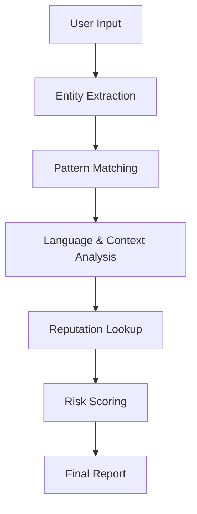

<div align="center">

# CrawView

### Offline scam & risk pattern analysis for the command line

<br>


<br>


</div>

<br>

---

## About

CrawView is an offline, command-line tool for analyzing text messages, emails, and chat content for common scam and social-engineering indicators. It reads a pasted message, pulls out identifiable entities such as URLs, email addresses, phone numbers, UPI IDs, and cryptocurrency addresses, and checks the surrounding text against a library of known scam-language patterns.

Every check runs locally through regular expressions and static rule sets. There is no network call, no external API, and no dependency on a threat-intelligence feed. This keeps the tool predictable, inspectable, and usable in disconnected environments, at the cost of being limited to whatever patterns are defined in its rule set.

The project was built as a hands-on exercise in pattern-based detection engineering, entity extraction, and CLI tool design, and is aimed at people who want to study or extend a small, readable scam-analysis engine rather than deploy a production security product.

<br>

---

## Features

| Feature | Description |
|---|---|
| Offline Processing | Every analysis runs locally, no internet connection is required |
| Rule-Based Detection | Findings are produced by explicit regex and keyword rules, not a trained model |
| Pattern Matching | Matches message content against curated scam-phrase and signal libraries |
| Entity Extraction | Pulls structured indicators out of free-form text |
| URL Detection | Flags links, shortened URLs, and high-risk-looking domains |
| Email Detection | Extracts email addresses referenced in the message |
| Phone Number Detection | Extracts phone numbers in common regional and international formats |
| UPI Detection | Identifies UPI payment IDs (e.g. `name@upi`, `name@okaxis`) |
| Cryptocurrency Address Detection | Detects Bitcoin and Ethereum-style wallet addresses |
| Context-Based Risk Scoring | Combines signal, language, and entity findings into a single risk score |
| Interactive CLI | Multi-line paste support with a simple analyze / stats / exit workflow |
| Local Reputation Storage | Remembers previously seen entities in a local JSON cache and scores repeats higher |
| Language Style Detection | Basic heuristic detection of English, Hindi, and Hinglish scam phrasing |

<br>

---

## Detection Workflow



<br>

---

## Project Structure

```
CrawView/
├── main.py                      # CLI entry point and analysis loop
├── core/
│   ├── analyzer.py               # Aggregates all detectors into one report
│   ├── entities.py               # Entity extraction (URLs, emails, phones, wallets, UPI)
│   ├── patterns.py               # Suspicious text pattern checks
│   ├── language.py               # Language style and scam-phrase detection
│   ├── context.py                # Multi-keyword context chain detection
│   └── behavioral.py             # Behavioral manipulation flow detection
├── intelligence/
│   ├── signals.py                 # Core weighted detection signals
│   ├── phrases.py                 # Regional scam phrase libraries
│   ├── context_chains.py          # Keyword chains for multi-step scam patterns
│   ├── behavioral_flows.py        # Manipulation flow definitions
│   └── global_scam_language_intelligence.py
├── utils/
│   ├── reputation.py              # Local JSON-based reputation cache
│   ├── statistics.py              # Session statistics tracker
│   ├── ioc_exporter.py            # Exports detected indicators to JSON/CSV
│   ├── report_writer.py           # Saves per-message analysis reports
│   ├── crypto.py                  # Wallet address validation helpers
│   └── colors.py                  # Terminal color output
├── reports/                      # Saved JSON analysis reports
├── iocs/                         # Exported indicator files (JSON/CSV)
├── tests/                        # Sample benign and phishing text files
├── img/                          # Screenshots and preview assets
└── LICENSE
```

<br>

---

## Installation

```bash
git clone https://github.com/<your-username>/CrawView.git
cd CrawView
python main.py
```

CrawView uses only the Python standard library, no `pip install` step is required.

**Requirements:** Python 3.9 or later.

<br>

---

## Usage

Run the tool and paste a message, then press Enter twice on an empty line to analyze it.

```bash
python main.py
```

```
⌁ ANALYSE >
Your account will be suspended today. Verify your KYC now at http://secure-kyc-verify.tk
Reply with your UPI ID: help@oksbi to avoid blocking.

```

Other available commands inside the session:

| Command | Action |
|---|---|
| `stats` | Displays session statistics for all messages analyzed so far |
| `exit` | Ends the session and shows a final summary |

<br>

---

## Example Analysis

**Input**

```
Your account will be suspended today. Verify your KYC now at http://secure-kyc-verify.tk
Reply with your UPI ID: help@oksbi to avoid blocking.
```

**Output**

| Field | Value |
|---|---|
| Risk Score | 110+ |
| Verdict | High Risk |
| Detected Indicators | Shortened/high-risk domain, UPI ID, urgency phrasing, KYC-verification pattern |
| Recommendation | Do not click the link or share account details |

<br>

---

## Detection Capabilities

| Category | Supported |
|---|:---:|
| Free-form text (SMS / email / chat) | ✅ |
| URL & domain detection | ✅ |
| Shortened URL detection | ✅ |
| Email address detection | ✅ |
| Phone number detection | ✅ |
| UPI ID detection | ✅ |
| Cryptocurrency wallet detection (BTC/ETH) | ✅ |
| IP address detection | ✅ |
| Language style detection (English/Hindi/Hinglish) | ✅ |
| Risk scoring | ✅ |
| Reputation memory (repeat entity tracking) | ✅ |
| Session statistics | ✅ |
| IOC export (JSON/CSV) | ✅ |
| Cloud / live threat feed lookup | ❌ |

<br>

---

## Screenshots

<div align="center">

**CLI interface**


<br><br>

**Analysis result**


<br><br>

**Session statistics**


</div>

<br>

---

## Tech Stack

| Layer | Technology |
|---|---|
| Language | Python 3 |
| Detection Logic | Regular expressions (`re`) |
| Data Storage | JSON (reputation cache, reports, IOC export) |
| Interface | Command-line (CLI) |

<br>

---

## Use Cases

- Cybersecurity students learning pattern-based detection concepts
- Python learners studying CLI tool design and regex-heavy codebases
- General scam-awareness checks on suspicious messages
- Offline text analysis where cloud tools are not an option
- A base project for security research and rule-set experimentation

<br>

---

## Limitations

- Detection is entirely rule-based; there is no machine learning or statistical model involved
- CLI only, there is no graphical interface
- No cloud integration of any kind
- No live threat feeds or external reputation lookups
- Accuracy depends on the coverage of the built-in phrase and pattern libraries, so novel scam wording may go undetected

<br>

---

## Author

**Maintained by:** `<Your Name>`
**GitHub:** [`@your-username`](https://github.com/your-username)

Feel free to open an issue or pull request if you'd like to contribute.

<br>

---

## License

This project is licensed under the [MIT License](LICENSE).

<br>

---

## Disclaimer

CrawView is built for educational and defensive cybersecurity purposes only. It is a pattern-matching aid, not a definitive fraud verdict, and should not be relied on as the sole basis for any security or financial decision. The author is not responsible for any misuse of this tool.

<br>

---

## Support

If you find CrawView useful, consider starring the repository, it helps others discover the project.

<div align="center">

⭐ **[Star this repository](#)** ⭐

</div>
